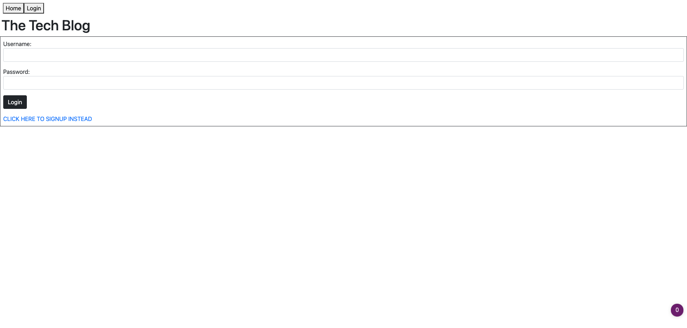

# Techno-Blog 

 ## Description
This Repository contains code for Rutgers Coding Bootcamp's Challenge 14 " Model-View-Controller (MVC) Challenge: Tech Blog". 

For this This week's challenge, we were tasked  to build a CMS-style blog site similar to a Wordpress site, where developers can publish their blog posts and comment on other developers’ posts as well. We are to build this site completely from scratch and deploy it to Heroku. The app will follow the MVC paradigm in its architectural structure, using Handlebars.js as the templating language, Sequelize as the ORM, and the express-session npm package for authentication.

# [CLICK HERE TO VISIT THE DEPLOYED APP](https://rromero-techno-blog.herokuapp.com/)

 ## Table Of Contents
  * [Description](#description)
  * [Screenshots](#screenshots)
  * [Installation](#installation)
  * [Usage](#usage)
  * [Contributing](#contributing)
  * [Questions](#questions)
  * [License](#license)

## Screenshots

Here are some screen shots of the app website:

 
## Installation

The app is already deployed and no installation is necessary! 

You can simply go to https://rromero-techno-blog.herokuapp.com/ to start using it.

However, if you would wish to configure the code, please do the following:
1. Download and install Node.js from https://nodejs.org/en/download/

2. Clone the repository OR download the code from https://github.com/ronnieve23/Techno-Blog

3. Navigate to where you saved the downloaded/cloned repository; Right click on the repostiory folder (MyNotes) and select "New Terminal at folder". 

4. Inside the terminal, type "npm i" and hit enter. Wait for the installation to finish.

5. Open the repository inside VS Code to start editing.

## Usage
1. Click "Login" to make an account. If you don't have an account yet, click on "CLICK HERE TO SIGNUP INSTEAD" to make one.
2. After logging in, you will be taken to your dashboard where you can make posts!

## Contributing

 You can contribute to the development of the app by sending suggestions to Ronnieve_Romero@yahoo.com

 ## Questions 

  For any questions, please feel free to reach out to me at the following:

  Github: https://github.com/ronnieve23

  Email: Ronnieve_Romero@yahoo.com

  ## License

 

  The packages used in this app are licensed under the MIT license. To read more about the MIT license, please click the following link:

  https://choosealicense.com/licenses/mit/
